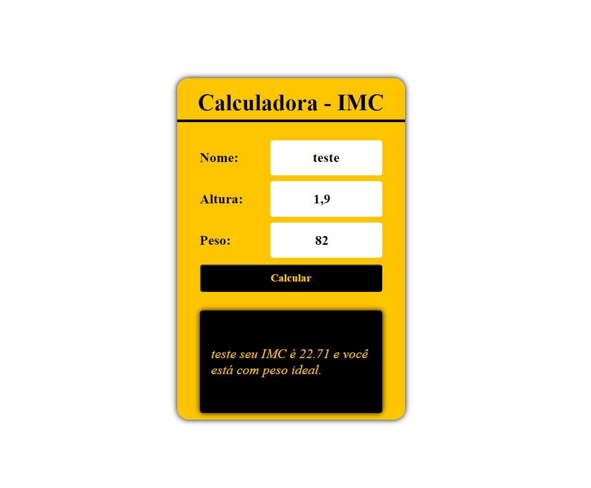

<h1 align="center"> Calculadora IMC </h1>

 

  

## 🚀 Tecnologias

Esse projeto foi desenvolvido com as seguintes tecnologias:

- HTML e CSS
- JavaScript
- Git e Github

## 💻 Projeto

Calculado IMC.

---

Feito por João Meireles :wave: [Linkedin](https://www.linkedin.com/in/jpw-meireles/)